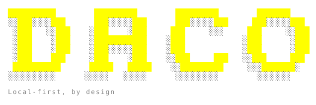

<p align="center">
  
</p>

<p align="center">
  Local-first CLI for authoring, validating, and translating data product specifications.
</p>

---

`daco` is a single-binary Go tool for building [OpenDPI](opendpi/)-compliant data
products on disk. It manages **products**, **connections**, **schemas**, and
**ports**, and translates port schemas into language and runtime targets
(PySpark, Avro, Protobuf, Pydantic, Go types, Scala, Spark/Databricks SQL, DQX
YAML, Markdown, and more).

A daco project is just two files on disk: `daco.yaml` (the project registry) and
per-product `opendpi.yaml` / `opendpi.json` specs with referenced JSON Schemas
under `schemas/`.

This repository also vendors the OpenDPI specification itself under
[`opendpi/`](opendpi/).

## Features

- **OpenDPI-native** — read/write OpenDPI specs with full `$ref` resolution
- **Schema translation** — port schemas → Avro, Protobuf, JSON Schema, Markdown,
  Python (Pydantic), PySpark, Spark SQL, Spark Scala, Scala, Databricks SQL,
  Databricks PySpark, Databricks Scala, Go types, Databricks DQX YAML
- **Interactive TUI** — run `daco` with no arguments for a guided shell
- **Format & lint** — `daco format` and `daco lint` across every product,
  connection, and schema in the project
- **Local-first** — no servers, no accounts; everything lives in your repo

## Installation

### Homebrew (macOS/Linux)

```bash
brew install dacolabs/tap/daco
```

### Scoop (Windows)

```powershell
scoop bucket add dacolabs https://github.com/dacolabs/scoop-bucket.git
scoop install daco
```

### Go install

```bash
go install github.com/dacolabs/daco/cmd/daco@latest
```

### Manual download

Pre-built archives for every supported platform are available on the
[releases page](https://github.com/dacolabs/cli/releases).

### Build from source

```bash
git clone https://github.com/dacolabs/cli.git
cd cli
make build
./bin/daco --help
```

Minimum Go version: **1.23**.

## Quickstart

```bash
# Initialize a daco project in the current directory
daco init --name my-project

# Create a product (scaffolds an opendpi.yaml under the given path)
daco products create -n analytics -p analytics/opendpi.yaml

# Add a connection and link it to the product
daco connections create -n warehouse -p connections/warehouse.yaml \
    -t postgresql --host db.example.com
daco products link -p analytics -c warehouse

# Add a schema and a port, then bind the schema to the port
daco schemas create -n customer -p schemas/customer.yaml
daco ports create -p analytics -n customers
daco ports link -p analytics --port customers --schema customer

# Translate a schema to a target format
daco schemas translate -n customer -f pydantic -o ./generated

# Sanity-check the whole project
daco format
daco lint

# Show version info
daco version
```

Run `daco --help` (or `daco <command> --help`) for the full reference, and just
`daco` for the interactive TUI.

## Repository layout

```
cmd/daco/           # daco CLI entrypoint
internal/cli/       # cobra commands, engine (business logic), settings, TUI
internal/opendpi/   # OpenDPI document/schema parsing, $ref resolution, I/O
internal/translate/ # Schema translators (one package per target)
internal/version/   # Build-time version info
opendpi/            # Vendored OpenDPI specification (this repo is the source)
docs/               # User-facing documentation and assets
landing/            # Marketing site (Next.js)
```

See [CONTRIBUTING.md](CONTRIBUTING.md) for the development guide and
[CLAUDE.md](CLAUDE.md) for a deeper architectural tour

## Documentation

- [OpenDPI specification](opendpi/) — the standard `daco` implements
- [Contributing guide](CONTRIBUTING.md)
- [Security policy](SECURITY.md)
- [Code of Conduct](CODE_OF_CONDUCT.md)

## License

Apache License 2.0 — see [LICENSE](LICENSE).
